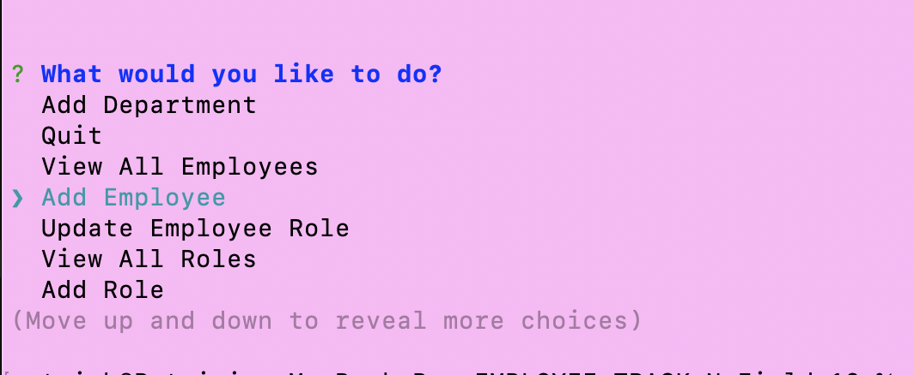
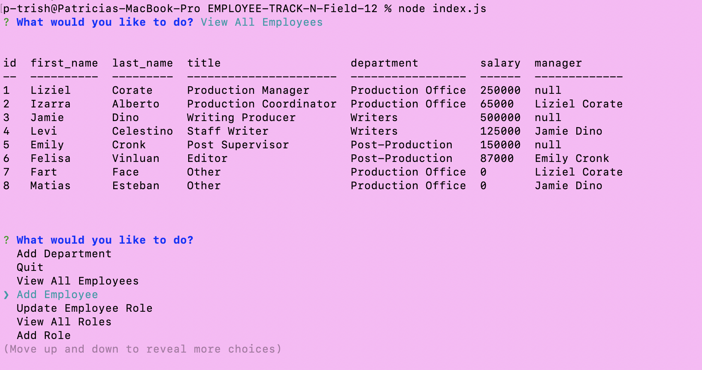
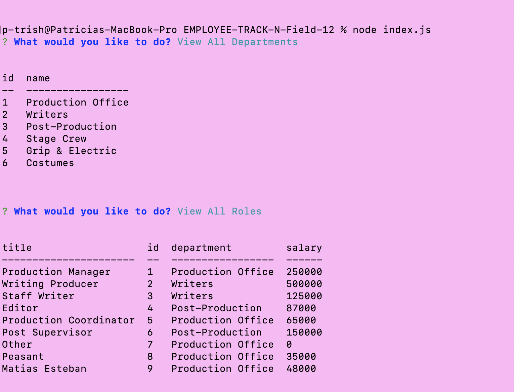
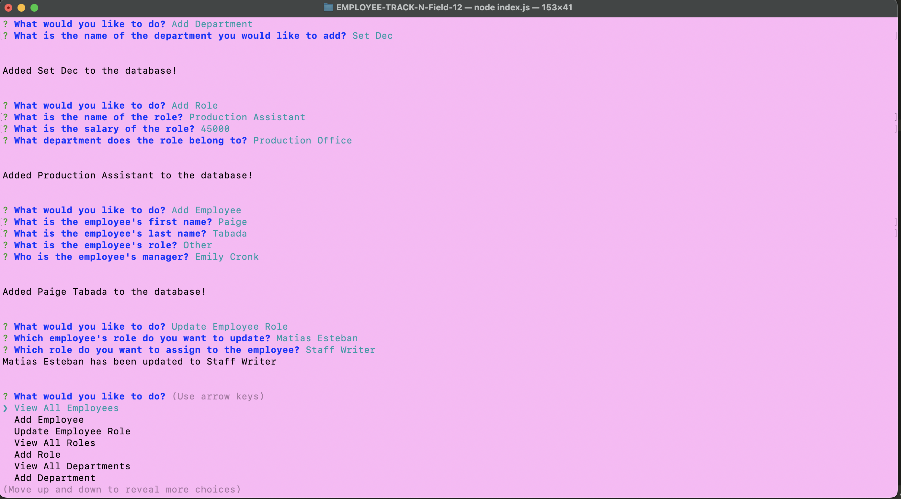

# EMPLOYEE-TRACK-N-Field-12

## Description

This project is an employee tracker built from scratch through the command-line applcation. It utilizes the console.table, dotenv, inquirer, and mysql2 packages and dependencies.  This application can be used to manage a company's employee database.  The motivation for this project is to take on the user story: 
"AS A business owner
I WANT to be able to view and manage the departments, roles, and employees in my company
SO THAT I can organize and plan my business,"
and create the application to solve this problem.

The Employee Tracker is developed for business owners, aiming to offer them a solution for managing and coordinating their employee roster.

By offering a simplified interface for users to interact with their data through the command line, the project addresses the challenge of database interfacing.

By building this Employee Tracker, I learned to further implement the packages and dependencies of console.table, dotenv, and mysql2.  I also learned how to read and write database and use them in javaScript.  

PLEASE SEE THE LINK CONTAINING A DEMO VIDEO OF THE APPLICATION: https://drive.google.com/file/d/12c7NSTGEa4lW32BhQ8z_2n3MoZdVeSgQ/view

## Installation

This project uses the following dependencies:
"console.table": "^0.10.0",
"dotenv": "^16.0.3",
"inquirer": "^8.2.4",
"mysql2": "^3.2.0"

The command 'npm i' is ran to install Node Package Manager, along with the above modules.

The query.sql, schema.sql, and seeds.sql files in the "db" folder are used to initialize and seed the database. 

## Usage

In the terminal I run the command node index.js in the root directory to open the application.  The user is then ment with a main menu to use the arrows to select options for interacting with the database.  The inquirer module was used to create the main menu and provide aided the user in guiding them through the questions for data entry.

When the user selects the "View" options, they are able to View All Employees, View All Departments, and View All Roles in which they are presented with the three tables respectively.  This is displayed via the console.table module. 

When the user selects one of the "Add" options, they are able to Add Department, Add Role, and Add Employee to insert data into the respective tables.  Addditionally, the user can also update an employee role.  The user is prompted to select an employee from a list of all employees, and then to choose a role to update from a list of all roles in the database.  When they update the employee role, it is added to the database. 

## Credits

​I'd like to thank the tutors that helped me get started and supported the writing of my code throughout creation of this project.

## License

N/A

## Questions

If you have any questions, please contact me directly at pkfalberto@gmail.com.  